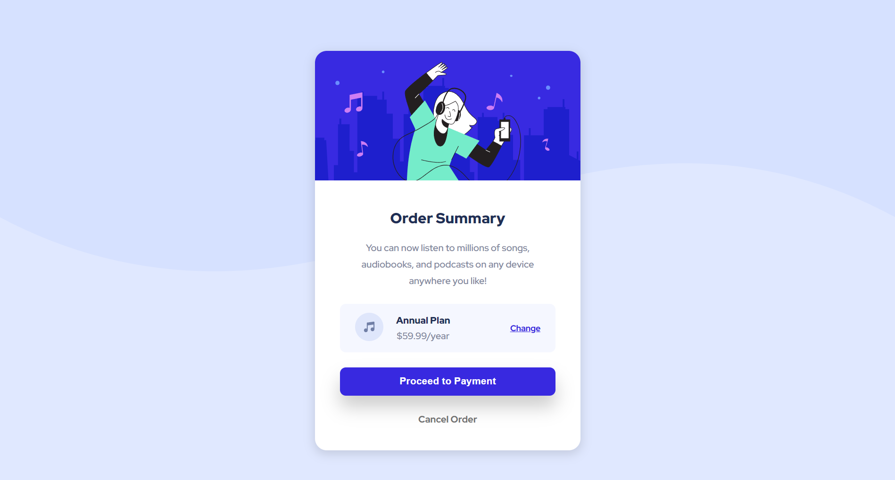

# Frontend Mentor - Order summary card solution

This is a solution to the [Order summary card challenge on Frontend Mentor](https://www.frontendmentor.io/challenges/order-summary-component-QlPmajDUj). Frontend Mentor challenges help you improve your coding skills by building realistic projects.

## Table of contents

- [Overview](#overview)
  - [Screenshot](#screenshot)
  - [Links](#links)
  - [Built with](#built-with)
  - [What I learned](#what-i-learned)
  - [Continued development](#continued-development)
- [Author](#author)

## Overview

### Screenshot



### Links

- Solution URL: [GitHub Repository](https://github.com/ValeriaMontoya/order-summary-card)
- Live Site URL: [Live site URL on GitHub Pages](https://valeriamontoya.github.io/order-summary-card/)

### Built with

- Semantic HTML5 markup
- CSS custom properties
- Flexbox
- Mobile-first workflow

### What I learned

For the challenge I used some best practices I know about.
One is importing the fonts on the HTML and not in the CSS. The other one is using the media queries on the HTML file and not in the CSS file.

Here's that part of my code:

```html
<link rel="preconnect" href="https://fonts.googleapis.com" />
<link rel="preconnect" href="https://fonts.gstatic.com" crossorigin />
<link
  href="https://fonts.googleapis.com/css2?family=Red+Hat+Display:wght@500;700;900&display=swap"
  rel="stylesheet"
/>
<link rel="stylesheet" href="./styles/styles.css" />
<link
  rel="stylesheet"
  href="./styles/desktop.css"
  media="screen and (min-width: 1440px)"
/>
```

### Continued development

I'd like to continue practicing with HTML and CSS so that I can move to JavaScript feeling confident enough.

## Author

- Frontend Mentor - [@ValeriaMontoya](https://www.frontendmentor.io/profile/ValeriaMontoya)
- Twitter - [@vale_montoya\_](https://twitter.com/vale_montoya_)
